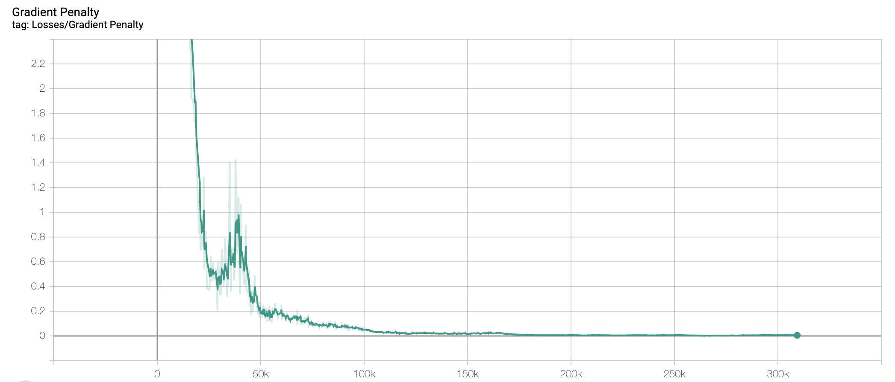

# gan_returns_simulation

Financial time series are complex by nature; the scarcity of historical financial data is a major hindrance in the development of trading algorithms. Most of those models are prone to overfitting as they have been trained on limited data; that of the realized history. Yet, there are possibly multiple states of the world all of which cannot be represented in a single time series. In this project, we train a Wasserstein Generative Adversarial Network to produce synthetic but realistic time series data. 

### Code Structure
The W-GAN was built in Python using the Pytorch framework. 

`generator.py` contains the Generator Class.

`discriminator.py` contains the Discriminator Class.

`data.py` contains the dataloader.

`main.py` contains the training loop and the basic graph for the model.

Once you have implemented the model, you can start training by running `main.py` with the following command:
`python3 main.py`

### Losses 
Discriminator loss over time:

Generator loss over time:

Gradient Penalty over time:

### Results
Some sample time series generated by our model for a time frame of 200 trading days:

We also generate multiple such synthetic samples and measure the moments of each sample. Here are some of the summary statistics as compared to the moments of samples from observed data:

Variance:

Skew:

Kurtosis:

### Setting up your environment
`conda create --name gan_returns python==3.6`

`conda install --force-reinstall -y -q --name gan_returns -c conda-forge --file requirements.txt`

`conda activate gan_returns`

To deactivate the environment you are in run:

`source deactivate`

### Additional Details
#### Downloading the stock dataset
1. Go to https://finance.yahoo.com/
2. Search for SPY or any other equity/ETF
3. Click on historical data
4. Select the time period
5. Download the csv file
6. Store it to the `data` folder in the project directory
